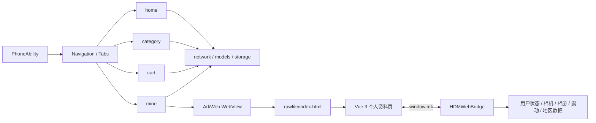

# 惠多美商城（HDM Mall）

一个以 HarmonyOS 原生端为主体、结合 Vue 3 H5 个人资料页的混合开发商城项目。

> **项目背景**
> 本项目以已有商城代码为基础，后续由本人持续完善和优化。个人实践重点包括 HarmonyOS 原生模块化整理、分类/搜索/详情商品展示一致性、SKU 交易边界、购物车与账号隔离的本地数据，以及 ArkWeb 与 Vue 3 H5 的资料和头像状态同步。

项目当前用于 HarmonyOS / ArkTS / ArkWeb 混合开发学习与作品展示，尚未上架应用市场。

## 项目能力

| 方向 | 当前实现 |
| --- | --- |
| 商城主流程 | 首页推荐、分类、搜索、商品详情与 SKU、购物车、结算页和个人中心 |
| 原生界面 | ArkTS + ArkUI，使用 `Navigation`、`NavPathStack`、`Tabs` 与状态装饰器组织页面 |
| 网络与状态 | Axios 请求封装、Token 注入、加载/空数据/异常状态处理、部分请求静默降级 |
| 本地数据 | Preferences 持久化用户信息、收藏与浏览足迹；收藏和足迹按登录账号隔离 |
| 混合开发 | ArkWeb 加载随应用交付的 Vue 3 H5，通过 `window.mk` 完成原生与 H5 双向通信 |
| 设备能力 | H5 可调用原生相机、相册、震动和地区数据能力 |
| 支付演示 | 原生收银台，确认支付后本地推进订单状态（不产生真实扣款） |
| 工程结构 | 原生端按 `commons`、`features`、`products` 拆分，H5 独立开发后构建进原生 `rawfile` |

## 技术栈

### HarmonyOS 原生端

- ArkTS、ArkUI、Stage 模型
- Navigation、NavPathStack、Tabs
- AppStorage、Preferences
- ArkWeb、JavaScript Proxy
- `@ohos/axios`
- Hvigor、OHPM

### H5 端

- Vue 3、TypeScript
- Vant、Pinia、Vue Router
- Axios、Vite
- `vite-plugin-singlefile`

## 架构概览



原生端负责商城主要页面、路由、网络、状态与本地数据；Vue 3 H5 负责个人资料编辑。H5 构建为单文件 `index.html`，随 HarmonyOS 应用一起交付，不依赖局域网开发服务器。

## 目录结构

```text
hdm-mall/
├─ mixed-development-h5/          # HarmonyOS 多模块工程
│  ├─ products/phone/             # 应用入口、PhoneAbility、根导航与 Tabs
│  ├─ commons/
│  │  ├─ constants/               # 全局常量与路由路径
│  │  ├─ models/                  # 业务模型
│  │  ├─ network/                 # Axios 请求封装
│  │  ├─ storage/                 # 用户、购物车、本地收藏与足迹
│  │  ├─ utils/                   # 通用工具
│  │  ├─ ui-components/           # 公共 ArkUI 组件
│  │  └─ device/                  # 相机、相册、震动、地区等设备能力
│  └─ features/
│     ├─ home/                    # 首页、搜索、商品详情与 SKU
│     ├─ category/                # 分类页面与分类数据适配
│     ├─ cart/                    # 购物车、结算、订单列表/详情、支付与支付结果页
│     └─ mine/                    # 登录、个人中心、本地数据页与 ArkWeb
└─ shoph5-vue3/                   # Vue 3 H5 个人资料页
   ├─ src/
   └─ scripts/sync-rawfile.mjs    # 将 dist/index.html 同步到原生 rawfile
```

## 个人实践重点

### 1. 原生工程模块化

将原先集中在公共模块中的能力按职责拆分为：

- `constants`：业务常量和页面路径；
- `models`：跨模块业务模型；
- `network`：请求实例、Token 注入和错误转换；
- `storage`：用户、购物车、收藏和浏览足迹；
- `device`：相机、相册、震动和地区数据；
- `ui-components`：跨业务复用的 ArkUI 组件；
- `home`、`category`、`cart`、`mine`：独立业务功能模块。

这样可以减少跨功能直接依赖，页面只组合所需的公共能力。

### 2. 商品展示一致性

围绕首页、分类、搜索结果和商品详情页，对商品数据进行了统一适配：

- 对齐同一商品的 ID、标题、主图与价格；
- 列表展示优先使用详情数据中的有效字段；
- 对图片地址和异常数据进行归一化；
- 单个详情请求失败时保留可展示的数据，避免整组商品不可用；
- 首页通过 `Promise.allSettled` 并发加载，部分接口失败时仍展示可用区块。

### 3. SKU 与交易边界

当详情接口不可用时，页面可以生成仅用于展示的兜底 SKU，但兜底 SKU 不属于后端真实对象 ID。因此在加入购物车和快捷购买前进行显式校验：

- 阻止 `_fallback_` SKU 进入交易请求；
- 加入购物车成功后才更新购物车状态；
- 快捷购买复用加入购物车结果，成功后才进入结算页；
- 请求失败时停留在当前页面并显示真实失败状态。

该处理用于保证“页面可展示”不会被误当成“数据可交易”。

### 4. 账号隔离的本地收藏与足迹

收藏和浏览足迹使用 Preferences 持久化，并根据当前登录账号生成独立存储作用域：

```text
favorite_goods_account_<account>
browse_history_account_<account>
```

未登录状态使用匿名作用域。旧版全局数据在登录后按规则迁移，避免不同账号之间互相看到本地记录。退出登录统一通过 `UserSession.logout()` 清理用户状态并刷新购物车。

> 收藏和浏览足迹当前是客户端本地能力，不描述为已经与后端账号数据同步。

### 5. ArkWeb 与 Vue 3 H5 通信

原生端通过 `javaScriptProxy` 注册 `window.mk`，向 H5 提供：

| Bridge 方法 | 作用 |
| --- | --- |
| `queryUser` | 查询原生端当前用户 |
| `updateUser` | 持久化资料并同步 AppStorage 状态 |
| `removeUser` | 统一退出登录 |
| `pickerCamera` | 调用原生相机 |
| `pickerPhoto` | 调用原生相册 |
| `vibrator` | 调用震动能力 |
| `getAreaColumns` | 获取地区选择数据 |

Vue 3 个人资料页通过类型声明约束 Bridge 接口。头像可以由相机或相册选择，在 H5 页面预览并上传，保存后再由 `updateUser` 同步回原生端。

### 6. 支付收银台与订单状态

支付页为原生收银台：

- 确认支付后写入按登录账号隔离的本地覆盖层，订单进入待发货，不产生真实扣款；
- 演示环境没有真实支付回调与评价接口契约，支付、发货、签收、评价状态推进由本地覆盖层完成，列表、详情、支付结果页统一按「服务端状态 + 本地覆盖层 + 本地评价」合并展示；本地已提交评价时完成态显示「已评价」，详情页可回看星级和内容；
- 演示行为由 `GlobalVariable.DEMO_ORDER_FLOW` 显式开关控制：打开时演示 API 拒绝发货/收货操作也按本地覆盖层推进（`features/cart/.../DemoOrderFlow.ets`），关闭后只有服务端成功才推进状态，支付入口直接提示未接入支付渠道。

## 本地开发

### 1. 构建 H5 并同步到 HarmonyOS

H5 工程使用 `pnpm-lock.yaml` 锁定依赖。

```bash
cd shoph5-vue3
pnpm install --frozen-lockfile
pnpm run build:mobile
```

`build:mobile` 会依次执行类型检查、生产构建，并将生成的 `dist/index.html` 复制到：

```text
mixed-development-h5/features/mine/src/main/resources/rawfile/index.html
```

仅开发 H5 时可以运行：

```bash
pnpm run dev
```

### 2. 构建 HarmonyOS 应用

使用 DevEco Studio 打开 `mixed-development-h5`，安装 OHPM 依赖并配置本机调试签名后构建项目。

Windows 命令行示例：

```powershell
& "<DevEco Studio>\tools\hvigor\bin\hvigorw.bat" assembleApp --mode project --no-incremental
```

这是多模块工程，命令行构建使用 project 模式；设备安装时使用项目产出的已签名 `.app` 包，而不是只安装单个 feature HAP。

> **签名安全：**证书、Profile、密钥库路径及密码只应保存在本机配置中，不应提交到公开仓库。公开提交前请再次检查 `build-profile.json5`。

## 测试与验证

原生业务模块包含本地单元测试，覆盖部分关键数据与边界逻辑，例如：

- 分类和商品展示数据适配；
- 商品图片、价格与 SKU 归一化；
- 兜底 SKU 识别；
- 购物车展示逻辑；
- ArkWeb 用户数据合并；
- 本地收藏和浏览足迹。

构建成功只表示源码和打包流程通过。安装、页面导航、接口数据、设备能力与视觉效果需要在目标 HarmonyOS 设备或模拟器上分别验证。

### 工程加固与稳定性验证

- 网络层只对幂等 GET 请求在网络错误、408、429 和 5xx 时做有限重试，创建订单、支付和其他写请求不会自动重放，避免重复业务操作。
- 同工程 HSP 依赖使用 `@module:<moduleName>` 管理，避免把同仓模块写成不可移植的本地 HAR 路径。
- 页面接口失败会进入明确的失败态或重试入口：首页、搜索、购物袋、订单、结算和支付页面不会把网络失败伪装成成功或无限加载。
- 支付结果页会查询服务端订单，并结合本地覆盖层展示演示支付结果；订单列表和详情共用 `OrderPresentation` 的状态文案与倒计时口径。本地已评价时完成态走 `getDisplayOrderStateText`，显示「已评价」而不是笼统的「已完成」。
- 取消订单只在旧接口不存在（HTTP 404/405）时降级到兼容路径，业务失败（如“已发货不能取消”）原样返回，不会对同一订单重复下发写请求。
- 订单状态支持本地覆盖层：演示环境没有真实支付回调或评价接口契约，支付、发货、签收、评价等推进写入按登录账号 scope 隔离的 Preferences 覆盖层；列表、详情、支付结果页统一按「服务端状态 + 本地覆盖层 + 本地评价」合并评估，并把无法与后端匹配的本地状态显式标记出来，不把本地演示状态伪装成真实订单状态。评价页的星级文案和快捷标签在 `EvaluationPresentation`，长度校验仍走 `DemoOrderStore.validateEvaluation`。
- 正式发布签名证书、Profile 与密钥库只保存在本机 DevEco Studio 配置中，不随仓库分发，安全注意事项见上文“签名安全”说明。

### 本地演示订单的筛选与评价

- “待发货 / 待收货 / 待评价”首屏会补查本地覆盖层候选订单的最新详情，再与服务端分页合并、按订单 ID 去重和创建时间排序，服务端取消状态仍优先。
- 分页结束以服务端页数或空页为准，不会因一条订单被本地状态过滤就截断；失败保留重试入口，切换标签或账号后旧响应不写回。
- 评价页使用缩小布局的键盘避让模式，离开时恢复原来的模式；星级和正文仅保存在本机，供演示与回看。
- 演示模式下，评价保存到本机后自动返回进入评价页之前的页面，不等待远程评价接口；保存失败保留输入和错误提示，手动离开后不会再次自动回退。

## 当前边界

- 项目尚未正式上架应用市场；
- 商品和购物车等远程数据依赖演示 API 的可用性；
- 收藏、浏览足迹是本地 Preferences 数据，不代表后端已同步；
- 兜底 SKU 仅用于详情展示，不会提交到交易接口；
- 支付闭环为本地模拟演示，不产生真实扣款，未接入正式商用支付；
- 项目演示视频可随求职材料提供。

## 仓库地址

<https://github.com/wangagan496/hdm-mall>
